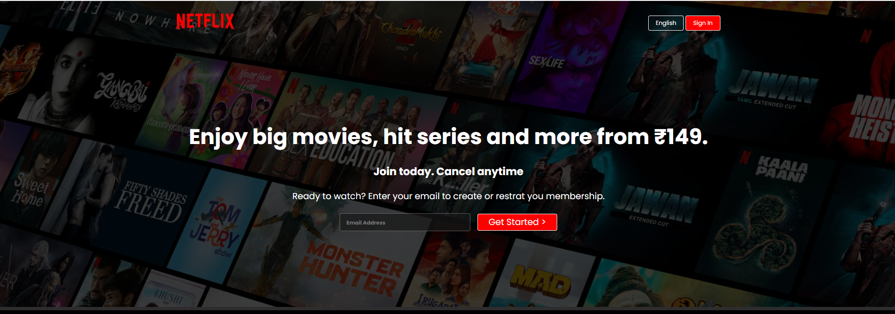
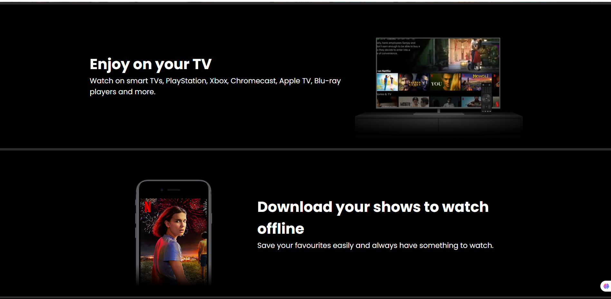
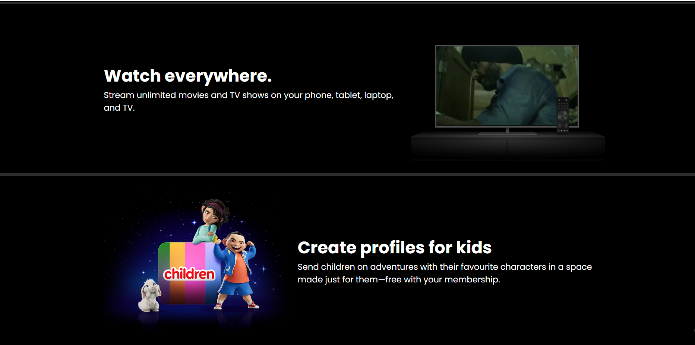
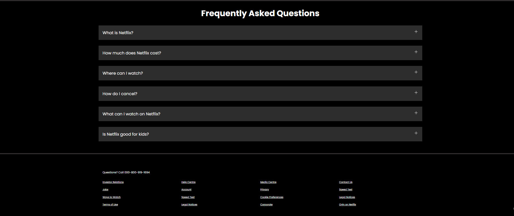

<p align="center">
  
</p>

<h1 align="center">Netflix Clone</h1>

<p align="center">
  A responsive clone of the Netflix landing page built using <strong>HTML5</strong> and <strong>CSS3</strong>.
</p>

<p align="center">
  
  
  
</p>

---

# 📖 About the Project

This project is a front-end recreation of the official Netflix landing page. The goal was to strengthen my understanding of modern web development fundamentals, including responsive layouts, Flexbox, CSS Grid, positioning, media queries, and UI design.

The project focuses on replicating Netflix's clean user interface while ensuring responsiveness across different screen sizes.

---

# ✨ Features

- 🎨 Netflix-inspired responsive UI
- 📱 Mobile-friendly layout
- 🖥️ Hero section with background image
- 📺 TV animation using embedded video
- 🎬 Multiple feature sections
- ❓ Frequently Asked Questions section
- 📄 Responsive footer
- ⚡ Clean and organized project structure

---

# 🛠️ Technologies Used

- HTML5
- CSS3
- Flexbox
- CSS Grid
- Media Queries
- Google Fonts

---

# 📸 Project Preview

## 🏠 Hero Section



---

## 📺 Entertainment Section



---


## ❓ FAQ Section



---

# 📂 Project Structure

```text
Netflix-Clone/
│
├── index.html
├── style.css
├── favicon.ico
│
├── images/
│   ├── bg.jpg
│   ├── logo.svg
│   ├── preview1.png
│   ├── preview2.png
│   ├── preview3.png
│   └── preview4.png
│
└── videos/
    └── video1.m4v
```

# 📌 Future Improvements

- Interactive FAQ Accordion using JavaScript
- Email Validation
- Loading Screen Animation
- Smooth Scroll Animations
- Improved Accessibility
- Additional UI Enhancements

---

# Author

**Tanuska Sharma**

Second-Year B.Tech Computer Science Student

---
